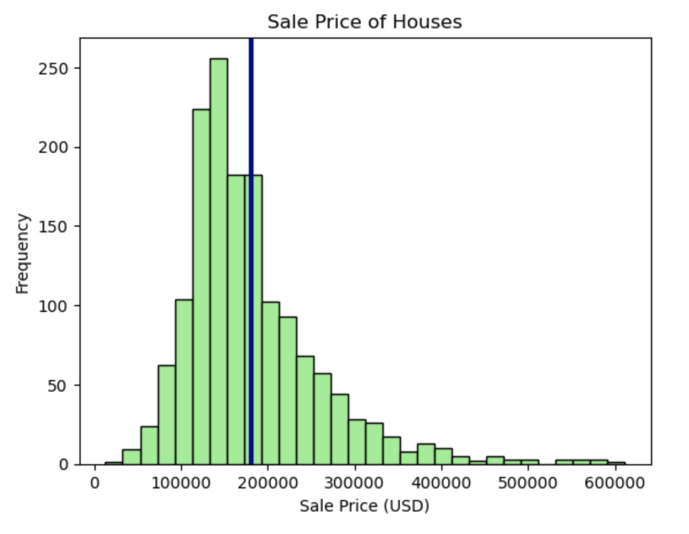
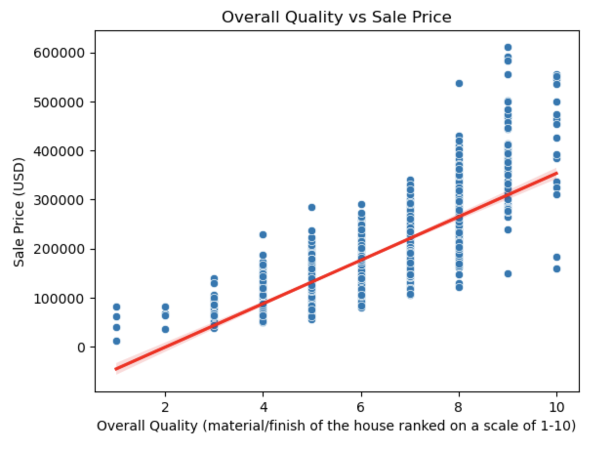
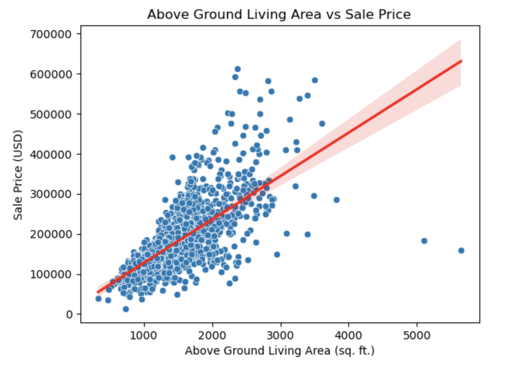
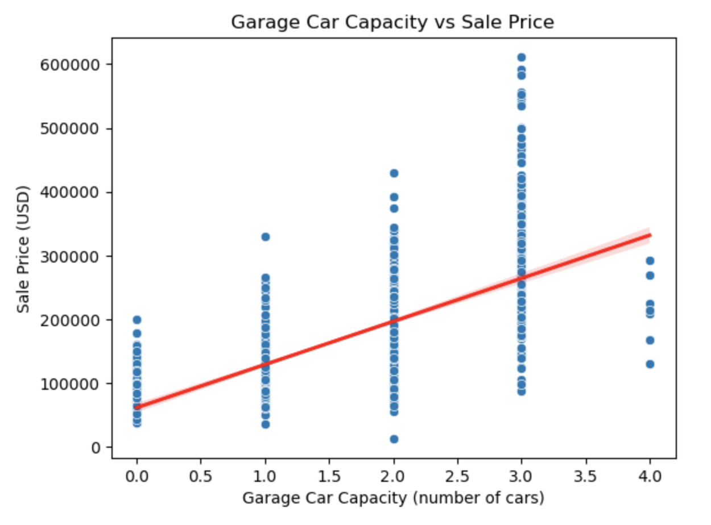

# Project 2: Factors Affecting the Value of Your Home

# Problem Statement
The housing market is a complex system influenced by various factors such as location, size, amenities, condition, and more. Understanding the relationship between some of these features and housing prices is crucial for current or future homeowners to decide whether or not they should remodel and sell or purchase a new home.

# Executive Summary
This study examines the top 20 housing-related features in order to understand important relationships between those different features that affect the value of the sale prices of homes. To do this, exploratory data analysis was conducted, several variables affecting housing prices were visualized, and models were created and evaluated. The model showed that approximately 90% of the variability in the sale price of homes can be explained by the features selected, and the most important features with a strong correlation with housing prices are the overall quality of the materials and finish of the house, the square footage of the above ground living area, and the garage car capacity.

# Table of Contents:
- [Project Title](#Project-2:-Factors-Affecting-the-Value-of-Your-Home)
- [Problem Statement](#Problem-Statement)
- [Executive Summary](#Executive-Summary)
- [Data Dictionary](#Data-Dictionary)
- [Visualizations](#Visualizations)
- [Model Results](#Model-Results)
- [Conclusions and Recommendations](#Conclusions-and-Recommendations)
- [Limitations and Future Studies](#Limitations-and-Future-Studies)
- [Sources](#Sources)

# Data Dictionary

The data used in this project comes from the Ames Housing Datasets (train.csv and test.csv). Please see the Ames Housing Data Documentation (https://jse.amstat.org/v19n3/decock/DataDocumentation.txt) for a more detailed look into the data descriptions. For the purposes of this study, the data dictionary below contains the data from train_selected.csv and displays 21 selected features, including the sale price.

|Feature|Type|Dataset|Description|
|---|---|---|---|
|SalePrice|int|train_selected.csv|Sale price of houses|
|Overall Qual|int|train_selected.csv|Rates the overall material and finish of the house|
|Gr Liv Area|int|train_selected.csv|Above grade (ground) living area square feet|
|Garage Cars|int|train_selected.csv|Size of garage in car capacity|
|Garage Area|float|train_selected.csv|Size of garage in square feet|
|Total Bsmt SF|float|train_selected.csv|Total square feet of basement area|
|1st Flr SF|int|train_selected.csv|First floor square feet|
|Exter Qual_TA|int|train_selected.csv|Typical/Average quality of the material on the exterior|
|Year Built|int|train_selected.csv|Original construction date|
|Year Remod/Add|int|train_selected.csv|Remodel date (same as construction date if no remodeling or additions)|
|Full Bath|int|train_selected.csv|Full bathrooms above grade|
|Kitchen Qual_TA|int|train_selected.csv|Typical/Average kitchen quality|
|Foundation_PConc|int|train_selected.csv|Poured concrete foundation|
|TotRms AbvGrd|int|train_selected.csv|Total rooms above grade (does not include bathrooms)|
|Mas Vnr Area|float|train_selected.csv|Masonry veneer area in square feet|
|Garage Yr Blt|float|train_selected.csv|Year garage was built|
|Fireplace Qu_Unknown|int|train_selected.csv|No Fireplace|
|Fireplaces|int|train_selected.csv|Number of fireplaces|
|BsmtFin Type 1_GLQ|int|train_selected.csv|Good living quarters rating of basement finished area|
|Bsmt Qual_TA|int|train_selected.csv|Typical (80-89 inches) height of the basement|
|Exter Qual_Gd|int|train_selected.csv|Good quality of the material on the exterior|

**Datasets**
- train.csv: Original training dataset given of all features, including sale prices.
- test.csv: Original testing dataset given of all features.
- train_cleaned.csv: Cleaned training dataset of all features, including sale prices.
- test_cleaned.csv: Cleaned testing dataset of all features.
- train_selected.csv: Cleaned training dataset with 21 selected features (including sale prices) after dummification and after conversion of boolean values to integer values, sorted from the strongest to the weakest correlations.
- kaggle_submission.csv: Kaggle submission of the predicted sale prices of homes of the test data.

# Visualizations

# Model Results
- Linear Regression Train R-Squared Score: 0.9206808854212489
- Linear Regression Test R-Squared Score: 0.8944642508966288
- Linear Regression Train Root Mean Squared Error: 22616.2558123308
- Linear Regression Test Root Mean Squared Error: 24725.554650210892
- Lasso Train R-Squared Score: 0.914897418967703
- Lasso Test R-Squared Score: 0.9072268668208476
- Lasso Train Root Mean Squared Error: 23426.270023515768
- Lasso Test Root Mean Squared Error: 23182.344536458095
- Ridge Train R-Squared Score: 0.9195974079845677
- Ridge Test R-Squared Score: 0.8972249932441634
- Ridge Train Root Mean Squared Error: 22770.197831958445
- Ridge Test Root Mean Squared Error: 24400.009813603217

# Conclusions and Recommendations
- Approximately 90% of the variability in the sale price of homes can be explained by the features in my models.
- On average, the models' predictions are only off by about \$20,000 to \$25,000, which is great, especially in this economy.
- The best factors that may increase housing prices are the overall quality of the materials and finish of the house, the square footage of the above ground living area, and the garage car capacity.
- Recommend current homeowners to remodel or add to the home before selling.
- Recommend future homeowners to check that important features are present in a home before buying.

# Limitations and Future Studies
- This study only looked at the top 20 features that can affect housing sale prices.
- Future studies should be conducted to see how additional features, whether that be more than 20 or a different set of 20, affect housing sale prices.
- The data used in this study are based on just one city in Iowa.
- The data for other cities in Iowa or throughout the United States should be collected and analyzed for improved results.
- The model explained approximately 90% of the variability in sale prices.
- There is always room for improvement to get an even better coefficient of determination closer to 100%.

# Sources
- Ames Housing Datasets:
    - train.csv
    - test.csv
- Ames Housing Data Documentation: https://jse.amstat.org/v19n3/decock/DataDocumentation.txt
- Zillow (Sold Houses in Ames, IA): https://www.zillow.com/ames-ia/sold/